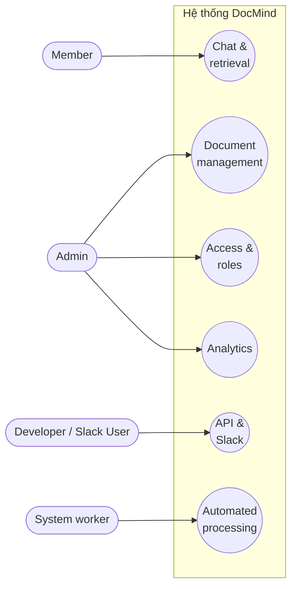

# DocMind — Use Case Specification

---

## 1. Danh sách Actor

| Actor | Mô tả |
|---|---|
| Admin / Owner | Quản lý workspace, tài liệu, phân quyền, tích hợp |
| Member | Người dùng cuối, chỉ chat hỏi-đáp |
| Developer (nội bộ tổ chức) | Gọi API để nhúng RAG engine vào hệ thống khác |
| Slack User | Người dùng đặt câu hỏi qua Slack bot |
| System / Background Worker | Actor hệ thống, chạy các job tự động |
| Super Admin *(nếu có multi-tenant billing)* | Quản lý plan, usage, khóa/mở tenant toàn hệ thống |

---

## 2. Use case theo Actor

### Admin / Owner
- UC01 — Tạo/xóa Collection (workspace con)
- UC02 — Upload tài liệu (PDF, DOCX, TXT, Markdown, URL)
- UC03 — Xóa tài liệu
- UC04 — Re-index tài liệu đã update
- UC05 — Xem trạng thái xử lý tài liệu (pending/processing/indexed/failed)
- UC06 — Mời user vào tenant, gán role
- UC07 — Gán quyền truy cập Collection theo user/nhóm
- UC08 — Tạo & thu hồi API key (scope theo collection)
- UC09 — Cài đặt Slack integration (OAuth install, map channel ↔ collection)
- UC10 — Xem Analytics dashboard (top câu hỏi, knowledge gap, usage/chi phí)
- UC11 — Cấu hình LLM provider (khi self-hosted)

### Member
- UC12 — Đặt câu hỏi qua chat UI (web)
- UC13 — Xem lịch sử hội thoại của mình
- UC14 — Xem citation/nguồn của câu trả lời
- UC15 — Đánh giá câu trả lời (thumbs up/down)
- UC16 — Xóa/archive hội thoại của mình

### Developer (nội bộ tổ chức)
- UC17 — Gọi API `/v1/query` để lấy answer + citation dạng JSON
- UC18 — Đăng ký webhook nhận event "câu hỏi không trả lời được"
- UC19 — Theo dõi usage/rate limit qua API key riêng

### Slack User
- UC20 — Gõ `/ask <câu hỏi>` trong channel
- UC21 — Nhận câu trả lời dạng thread kèm citation

### System / Background Worker (tự động, không do người dùng trigger trực tiếp)
- UC22 — Extract text từ file upload
- UC23 — Chunk văn bản theo strategy đã định
- UC24 — Generate embedding và lưu vào pgvector
- UC25 — Retry job khi gọi API embedding thất bại
- UC26 — Sync tự động khi tài liệu nguồn ngoài (Drive/Notion) thay đổi
- UC27 — Log usage token/cost theo tenant

### Super Admin *(nếu có multi-tenant billing)*
- UC28 — Quản lý gói/plan theo tenant
- UC29 — Giám sát usage toàn hệ thống
- UC30 — Khóa/mở tenant

---

## 3. Use case gộp theo nhóm giá trị (business scenario)

Mục đích: nối use case kỹ thuật với kịch bản kinh doanh thực tế — trả lời câu hỏi "ai dùng cái này và để làm gì".

| Nhóm use case | Actor chính | Kịch bản thực tế |
|---|---|---|
| Document management | Admin | Giảm thời gian setup, đảm bảo tài liệu luôn cập nhật |
| Chat & retrieval | Member | Nhân viên tự tra cứu chính sách/tài liệu thay vì hỏi người khác |
| Access & roles | Admin | Đảm bảo mỗi phòng ban chỉ thấy tài liệu của mình (bảo mật nội bộ) |
| API & Slack integration | Developer, Slack User | Nhúng RAG vào quy trình có sẵn (Slack, hệ thống nội bộ) — điểm khác biệt với NotebookLM |
| Analytics & feedback | Admin | Phát hiện knowledge gap, đo ROI (số câu hỏi bot tự trả lời được) |
| Automated processing | System | Đảm bảo pipeline embedding chạy ổn định, không cần can thiệp thủ công |

---

## 4. Sơ đồ Use Case (dạng mermaid, dự phòng nếu cần chỉnh sửa)

---

## 5. Ghi chú định vị

Nhóm **API & Slack integration** là nơi thể hiện rõ nhất sự khác biệt của DocMind so với các sản phẩm consumer-facing như NotebookLM/Gemini Notebook — vì đây là nhóm use case duy nhất cho phép hệ thống được **nhúng vào quy trình làm việc có sẵn** thay vì bắt người dùng chuyển sang một app mới.
